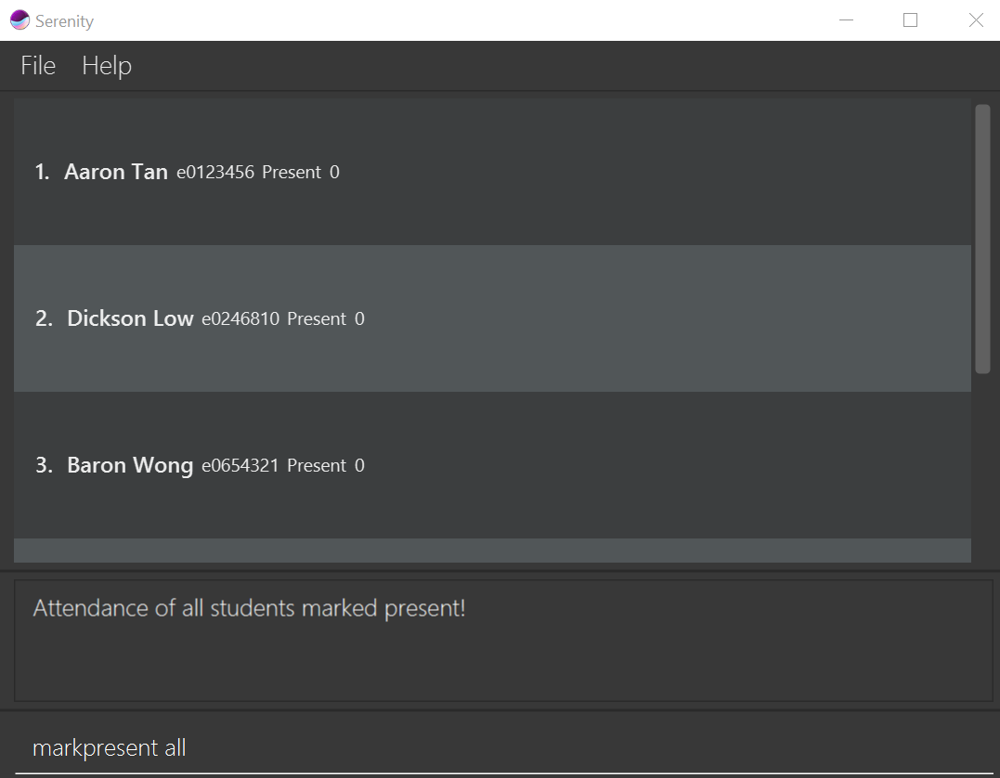
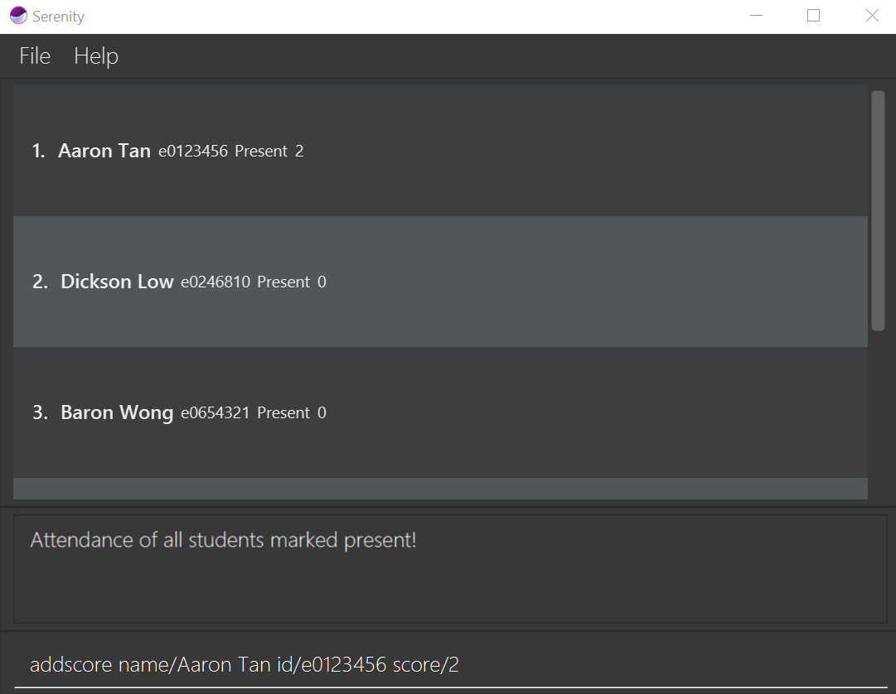

# Serenity - User Guide

By: `Team Serenity` Since: `Aug 2020`

1. [Introduction](#introduction)

2. [Quick Start](#quick-start)

3. [About](#about)

4. [Features](#features)

   4.1. [Setup](#setup)

     * [Setup classes at the start of a semester: `importCsv`](#setup-classes-at-the-start-of-a-semester-importcsv)

   4.2. [Attendance Taking](#attendance-taking)

     * [Mark attendance for a every student: `markAll`](#mark-attendance-for-every-student-markall)

     * [Mark attendance for a single student: `mark`](#mark-attendance-for-a-single-student-mark)

     * [Flag attendance for a single student: `flag`](#flag-attendance-for-a-single-student-flag)

     * [View attendance for a each class: `attendance`](#view-attendance-for-each-class-attendance)

     * [Exporting of attendance to CSV: `exportAtt`](#exporting-of-attendance-to-csv-exportatt)

   4.3. [Class Participation](#class-participation)

     * [Awarding class participation marks: `award`](#awarding-class-participation-marks-award)

     * [Viewing statistics of class participation `stats`](#viewing-statistics-of-class-participation-stats)

     * [Exporting of class participation grades to CSV: `exportCp`](#exporting-of-class-participation-grades-to-csv-exportcp)

   4.4 [Addressing Questions](#addressing-questions)

     * [Adding a question: `addQn`](#adding-a-question-addqn)

     * [Viewing all questions: `questions`](#viewing-all-questions-list)

     * [Deleting a question: `deleteQn`](#deleting-a-question-deleteqn)

     * [Marking a question as answered: `ansQn`](#marking-a-question-as-answered-ansqn)

5. [FAQ](#faq)

6. [Command Summary](#command-summary)

## Introduction

Welcome to the User Guide of **Serenity**!

Are you a tutor for CS2101, but annoyed at keeping track of attendance, questions and class participation grades on different 
excel sheets for different classes? Fret not, our application, **Serenity**, will help keep you sane when doing the necessary 
administrative work. **Serenity** is a desktop application that helps CS2101 tutors **manage their classes**. This  
application is optimized for use through a *Command Line Interface(CLI)*, meaning that you operate the application by 
typing commands into a command box.

This user guide serves to provide you with an in-depth documentation on how to set up and use our application. with that said
let's get [started](#quick-start)!

## Quick start

1. Ensure you have Java `11` or above installed in your Computer.

2. Download the latest `Serenity.jar` from [here]().

3. Copy the file to the folder you want to use as the _home folder_ for your AddressBook.

4. Double-click the file to start the app. The GUI similar to the below should appear in a few seconds. Note how the app contains some sample data. 
   

5. Type the command in the command box and press Enter to execute it. 

6. Refer to the [Features](#features) below for details of each command.

--------------------------------------------------------------------------------------------------------------------

## About

about goes here

--------------------------------------------------------------------------------------------------------------------

## Features

### <ins>Setup</ins>

#### Set up classes at the start of a semester: `importCsv`

You can set up classes automatically by importing CSV data.

1. Copy and paste CSV file into home folder. 
2. Enter `importCsv` in the command line.
3. The program will update the classes and students for you.
4. The program is now ready to assist you in managing your CS2101 class.

---

### <ins>4.2. Attendance Taking</ins>

#### 4.2.1. Mark attendance for a single student as present: `markpresent`
You can use this command to mark attendance for a specific student in a tutorial lesson.

**Format:**
`markpresent name/NAME id/STUDENT_ID`

**Example:**

There is a student named `Aaron Tan` with Student ID of `e0123456` who is present for the tutorial lesson `1-2` of group `G04`. 

To mark him present:
1. Navigate to view group G04 lesson 1-2 via  command.
2. Type `markpresent name/Aaron Tan id/e0123456` into the *Command Box*.
3. Press `Enter` to execute.

Outcome:
1. The *Result Display* will show a success message.
2. You can now see that his attendance has been updated on the *Student Information Panel*.

#### 4.2.2. Mark attendance for a single student as absent: `markabsent`
You can use this command to mark a specific student absent for a tutorial lesson.

**Format:**
`markabsent name/NAME id/STUDENT_ID`

**Example:**

There is a student `Aaron Tan` with Student ID `e0123456` from group `G04` who is absent for your tutorial lesson `1-2`. 

To mark him absent:
1. Navigate to view group G04 lesson 1-2 via  command.
2. Type `markabsent name/Aaron Tan id/e0123456` into the *Command Box*.
3. Press `Enter` to execute.

Outcome:
1. The *Result Display* will show a success message.
2. You can now see that his attendance has been updated on the *Student Information Panel*.

#### 4.2.3. Mark attendance for all students: `markpresent all`
You can use this command to mark attendance for all students in a tutorial lesson.

**Format:**
`markpresent all`

**Example:**

All students in group `G04` are present for the tutorial lesson `1-2`. 

To mark all of them present at once:
1. Navigate to view group `G04` lesson `1-2` via  command.
2. Type `markpresent all` into the *Command Box*.
3. Press `Enter` to execute.

Outcome:
1. The *Result Display* will show a success message.
2. You can now see that all the students' attendance have been updated on the *Student Information Panel*.

#### Flag attendance for a single student: `flag`

Flag attendance so you will be reminded to check again 
at the end of class.

Format: `flag TUTORIAL_GROUP LESSON_NUMBER NAME`

Examples:
 * flag G04 1-1 john
 * flag G09 7-2 ryan

Outcome:

#### View attendance for each class: `attendance`

Provides a graphical view of all the student's 
attendance for a particular lesson.

Format: `attendance TUTORIAL_GROUP LESSON_NUMBER`

Examples:
 * attendance G04 1-1
 * attendance G09 7-2

Outcome:

#### Exporting of attendance to CSV: `exportAtt`

Export the attendance for a particular tutorial group 
in a CSV file.

Format: `exportAtt TUTORIAL_GROUP`

File will be saved where your JAR file is located, with the file name
`TUTORIAL_GROUP.csv`.

Examples:
 * `exportAtt G04` saves the file as `G04.csv`
 * `exportAtt G09` saves the file as `G09.csv`

Outcome:

---

### <ins>4.3. Participation Marking</ins>

Need to keep track of all your students' participation during lessons quickly? This feature allow you to key in a student's participation score easily with a scale for reference.

#### 4.3.1. Award participation score for a student: `addscore`
You can use this command to add the participation score for a specific student in a tutorial lesson.

With a scale from 1 to 5:
Score | 1 | 2 | 3 | 4 | 5 | 
------|---|---|---|---|---
**Remark** |Very Poor| Poor| Sufficient|Good|Commendable

**Format:**
`addscore MARK name/NAME id/STUDENT_ID`

**Example:**

After **lesson 1-2**, you felt that your student `Aaron Tan` with Student ID `e0123456`  from **group G04** participated sufficiently in class but could be more active, you would like to give him a `3` for his participation.

To give him a score:
1. Navigate to view group G04 lesson 1-2 via  command.
2. Type `addscore 3 name/Aaron Tan id/e0123456` into the *Command Box*.
3. Press `Enter` to execute.

Outcome:
1. The *Result Display* will show a success message.
2. You can now see that his score has been updated on the *Student Information Panel*.

#### Viewing statistics of class participation: `stats`

you can use this command to view the average score for each student for a specific tutorial group and tutorial.

##### Format:

`stats TUTORIAL_GROUP LESSON_NUMBER`

##### Example:

If you wish to view the average participation marks for tutorial group `GO9` and tutorial `7-2`, follow the steps below 
to learn how. 

Viewing the average class participation mark

1. Type `stats G09 7-2`

2. Press `enter` to execute the command 

Outcome:

#### Exporting of class participation grades to CSV: `exportCp`

You can use this command to export the class participation marks of a specified tutorial group into a CSV file.

##### Format:

`exportcp TUTORIAL_GROUP`

##### Example:

Assuming you need to collate the class participation marks for tutorial group `GO7` into a CSV file for grading on a 
different platform (i.e LuimiNUS). You can do the following steps

Exporting class participation marks:

1. Type `exportcp G07`

2. Press `enter` to execute the command 

Outcome:

---

### <ins>Addressing Questions</ins>

#### Adding a question: `addQn`

Adds a question to the list of questions of a specified tutorial group.

##### Format:

`addQn TUTORIAL_GROUP LESSON_NUMBER QUESTION_DESCRIPTION`

##### Examples:
* `addQn G07 7-1 Could you elaborate on the marking scheme for OP1?`
* `addQn G07 7-1 What are the deadlines that students should take note of?`

Outcome:

#### Viewing all questions: `questions`

View a list of all the questions from a specified tutorial group.

##### Format:

`questions TUTORIAL_GROUP LESSON_NUMBER`

##### Examples:
* `questions G07 7-1`
* `questions G10 5-2`

Outcome:

#### Deleting a question: `deleteQn`

Deletes the specific question from the list of questions of a specified tutorial group.

##### Format:

`deleteQn TUTORIAL_GROUP LESSON_NUMBER INDEX`
* Deletes the question at the specified `INDEX`.
* The index refers to the index number shown in the displayed question list.
* The index **must be a positive integer** 1, 2, 3, …​

##### Examples:
* `deleteQn G07 7-1 1`
* `deleteQn G10 5-2 3`

Outcome:

#### Marking a question as answered: `ansQn` 

Marks the specified question from the list of questions of a specified tutorial group as answered.

##### Format:

`ansQn TUTORIAL_GROUP LESSON_NUMBER INDEX`
* Marks the question at the specified `INDEX` as answered.
* The index refers to the index number shown in the displayed question list.
* The index **must be a positive integer** 1, 2, 3, …​

##### Examples:
* `ansQn G07 7-1 1`
* `ansQn G10 5-2 3`

Outcome:

--------------------------------------------------------------------------------------------------------------------

## FAQ

--------------------------------------------------------------------------------------------------------------------

## Command summary

Action | Format, Examples
--------|------------------
Add New Tutorial Group | For a tutorial group - Format: `importCsv`
Mark/Unmark Attendance | For an individual student - Format: `mark TUTORIAL_GROUP LESSON_NUMBER NAME` Example:`mark G04 1-2 ryan` For every student in a tutorial class - Format: `markAll TUTORIAL_GROUP LESSON_NUMBER` Example: `markAll G04 1-2`
Flag Attendance | For an individual student - Format: `flag TUTORIAL_GROUP LESSON_NUMBER NAME` Example: `flag G04 1-2 ryan`
View Attendance | For a tutorial group - Format: `attendance TUTORIAL_GROUP LESSON_NUMBER` Example: `attendance G04 1-2`
Export Attendance | For a tutorial group - Format: `exportAtt TUTORIAL_GROUP` Example: `exportAtt G04`
Award Participation Score | For an individual student - Format: `award TUTORIAL_GROUP LESSON_NUMBER NAME MARKS` Example: `award G04 1-2 ryan 3`
View Average Participation Score (across tutorial weeks) | For a tutorial group - Format: `stats TUTORIAL GROUP LESSON_NUMBER` Example: `stats G04 1-2`
Export Participation Score | For a tutorial group - Format: `exportCp TUTORIAL_GROUP` Example: `exportCp G04`
Add A Question | Across all tutorial groups - Format: `addQn QUESTION_DESCRIPTION` Example: `addQn What are the deadlines that students should take note of?`
View All Questions | Across all tutorial groups - Format: `list`
Delete A Question | Across all tutorial groups - Format: `deleteQn INDEX` Example: `deleteQn 1`
Mark A Question As Answered | Across all tutorial groups - Format: `ansQn INDEX` Example: `ansQn 1`
