## Table of Contents
1. [**Introduction**](#1-introduction) 
2. [**About**](#2-about) 
    2.1. [Structure of this Document](#21-structure-of-this-document) 
    2.2. [Reading this Document](#22-reading-this-document) 
    &nbsp;&nbsp;&nbsp;&nbsp;&nbsp;&nbsp;2.2.1. [Sections of the Application Window](#221-sections-of-the-application-window) 
    &nbsp;&nbsp;&nbsp;&nbsp;&nbsp;&nbsp;2.2.2. [Special Formats](#222-special-formats) 
    &nbsp;&nbsp;&nbsp;&nbsp;&nbsp;&nbsp;2.2.3. [Command Format](#223-command-format) 
3. [**Quick Start**](#3-quick-start) 
4. [**Navigation Between Tabs**](#4-navigation-between-tabs) 
5. [**Features**](#5-features) 
    5.1. [Patient Information Management](#51-patient-information-management) 
    &nbsp;&nbsp;&nbsp;&nbsp;&nbsp;&nbsp;5.1.1. [Add a new patient: `addpatient`](#511-add-a-new-patient-addpatient) 
    &nbsp;&nbsp;&nbsp;&nbsp;&nbsp;&nbsp;5.1.2. [List all patients: `listpatients`](#512-list-all-patients-listpatients) 
    &nbsp;&nbsp;&nbsp;&nbsp;&nbsp;&nbsp;5.1.3. [Edit a patient's information: `editpatient`](#513-edit-a-patients-information-editpatient) 
    &nbsp;&nbsp;&nbsp;&nbsp;&nbsp;&nbsp;5.1.4. [Add a remark to a patient: `remark`](#514-add-a-remark-to-a-patient-remark) 
    &nbsp;&nbsp;&nbsp;&nbsp;&nbsp;&nbsp;5.1.5. [Find patient by name: `findpatient`](#515-find-patient-by-name-findpatient) 
    &nbsp;&nbsp;&nbsp;&nbsp;&nbsp;&nbsp;5.1.6. [Delete a patient profile: `deletepatient`](#516-delete-a-patient-deletepatient) 
    5.2. [Appointment Information Management](#52-appointment-information-management) 
    &nbsp;&nbsp;&nbsp;&nbsp;&nbsp;&nbsp;5.2.1. [Add a new appointment: `addappt`](#521-add-a-new-appointment-addappt) 
    &nbsp;&nbsp;&nbsp;&nbsp;&nbsp;&nbsp;5.2.2. [List all appointments: `listappts`](#522-list-all-appointments-listappts) 
    &nbsp;&nbsp;&nbsp;&nbsp;&nbsp;&nbsp;5.2.3. [List all appointments of a patient: `listapptsof`](#523-list-all-appointments-of-a-patient-listapptsof) 
    &nbsp;&nbsp;&nbsp;&nbsp;&nbsp;&nbsp;5.2.4. [Edit an appointment: `editappt`](#524-edit-an-appointment-editappt) 
    &nbsp;&nbsp;&nbsp;&nbsp;&nbsp;&nbsp;5.2.5. [Mark an appointment as done: `done`](#525-mark-an-appointment-as-done-done) 
    &nbsp;&nbsp;&nbsp;&nbsp;&nbsp;&nbsp;5.2.6. [Mark an appointment as missed: `missed`](#526-mark-an-appointment-as-missed-missed) 
    &nbsp;&nbsp;&nbsp;&nbsp;&nbsp;&nbsp;5.2.7. [Find appointment by keyword: `findappt`](#527-find-appointment-by-keyword-findappt) 
    &nbsp;&nbsp;&nbsp;&nbsp;&nbsp;&nbsp;5.2.8. [Cancel an appointment: `cancel`](#528-cancel-an-appointment-cancel) 
    5.3. [Calendar](#53-calendar) 
    &nbsp;&nbsp;&nbsp;&nbsp;&nbsp;&nbsp;5.3.1. [Switch to a particular year: `year`](#531-switch-to-a-particular-year-year) 
    &nbsp;&nbsp;&nbsp;&nbsp;&nbsp;&nbsp;5.3.2. [Switch to a particular month: `month`](#532-switch-to-a-particular-month-month) 
    &nbsp;&nbsp;&nbsp;&nbsp;&nbsp;&nbsp;5.3.3. [Display schedule of a particular day: `day`](#533-display-schedule-of-a-particular-day-day) 
    5.4. [Utilities](#54-utilities) 
    &nbsp;&nbsp;&nbsp;&nbsp;&nbsp;&nbsp;5.4.1. [View help : `help`](#541-view-help-help) 
    &nbsp;&nbsp;&nbsp;&nbsp;&nbsp;&nbsp;5.4.2. [Exit the program: `exit`](#542-exit-the-program--exit) 
    &nbsp;&nbsp;&nbsp;&nbsp;&nbsp;&nbsp;5.4.3. [Clear all data: `clear`](#543-clear-all-data-in-baymax-clear) 
    5.5. [Features coming in Version 2.0](#55-features-coming-in-version-20) 
    &nbsp;&nbsp;&nbsp;&nbsp;&nbsp;&nbsp;5.5.1. [Undo/Redo v2.0](#551-undoredo-v20) 
    &nbsp;&nbsp;&nbsp;&nbsp;&nbsp;&nbsp;5.5.2. [Display appointments within a period v2.0](#552-display-appointments-within-a-period-v20) 
6. [**FAQ**](#6-faq) 
7. [**Command Summary**](#7-command-summary) 
    7.1. [Patient Information Management Commands](#71-patient-information-management-commands) 
    7.2. [Appointment Information Management Commands](#72-appointment-information-management-commands) 
    7.3. [Calendar Commands](#73-calendar-commands) 
    7.4. [Utility Commands](#74-utility-commands) 

--------------------------------------------------------------------------------------------------------------------

## 1. Introduction
(Contributed by Li Jianhan & Shi Hui Ling)

Welcome to Baymax! Are you a clinic receptionist looking for a reliable app to keep track of patients and
appointments? You have come to the right place!

Baymax is a Command Line Interface (CLI) focused desktop application that helps you to manage patient appointments using just
the keyboard itself, no fiddling with the mouse needed. The main features include:

1. Appointment management
2. Patient information management
3. Calendar view

With Baymax, you can manage appointments efficiently with our integrated Calendar tool. We have put a lot of effort into
designing our User Interface so that it feels as intuitive to first-time users as it can be. You will be amazed by what 
you can achieve with Baymax through a clean and simple User Interface. What are you waiting for? Head on to [Section 3 Quick Start](#3-quick-start)!

--------------------------------------------------------------------------------

## 2. About
(Contributed by Li Jianhan, Thuta Htun Wai, Kaitlyn Ng, Reuben & Shi Hui Ling)

This section will familiarise you with the general terms and information you need to know to make the best use of this User Guide!

### 2.1. Structure of this Document
To give you the most amount of flexibility over what you can do with Baymax, we have provided a large set of features.
We have structured this User Guide in such a way that you can easily find what you need. In the next subsection,
[Section 2.2 Reading this Document](#22-reading-this-document), you will find useful tips on using this document. All of Baymax's features and commands are documented in the following section, [Section 5 Features](#5-features). You can sift through these features and commands easily by referring to the [Table of Contents](#table-of-contents) at the top of this User Guide, or to [Section 7 Command Summary](#7-command-summary).

### 2.2. Reading this Document
This subsection familiarises you with all the technical terms, symbols and expressions that are used throughout this 
document, in order to make it easier for you to read it. 

#### 2.2.1. Sections of the Application Window

We will be referring to certain parts of the application window by their names as shown in the image below:

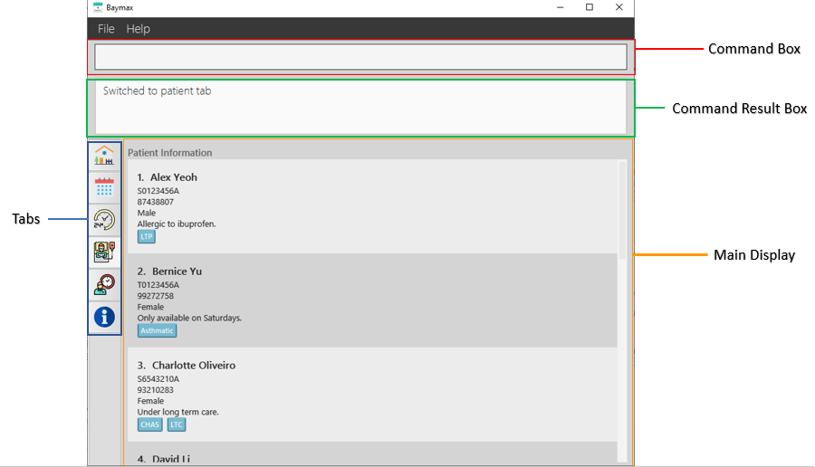 
*Figure 2.2.1a. Sections of the Application Window*

Section of Window | Description
--------------|--------------
Command Box   | Commands are entered here.
Command Result Box | Success and error messages after running commands are displayed here.
Tabs | Dashboard, Calendar, Schedule, Patient, Appointment, and Additional Information tabs can be accessed here. Note that the tabs are **not** clickable. See [Section 4 Navigation Between Tabs](#4-navigation-between-tabs) to find out how to navigate between tabs.
Main Display | Calendar views, Patient lists and Appointment lists are displayed here in their respective tabs.

#### 2.2.2. Special Formats

The table below explains some special terms and formatting used throughout this document.

Formatting    |  What does it mean?
---------------- | -------------------
<ins>underlined</ins> | Underlined text gives you information that you need to pay more attention to.
`command`           | Highlighted text in this particular font indicates a command that can be typed into the Command Box and run by the application.
:bulb: **Note:**        | This symbol gives you special tips regarding the specific command/feature.
:warning: **Warning:**     | The warning icon tells you to take caution before using the command/feature.

#### 2.2.3. Command Format

To use Baymax's features and perform tasks, you can enter specific commands into the Command Box.

Most of the commands take the following format: 

`command_word prefix/INPUT`, e.g. `addpatient name/Alex Yeoh nric/S1234567A phone/98765432 gender/M`
* **command_word:** word that specifies the task being performed, e.g. `addpatient`
* **prefix:** word that specifies the input type being supplied, e.g. `name`, `nric`
* **INPUT:** information and details about various patients and appointments specified by you, e.g. `Alex Yeoh`
* **Field:** a type of input information, i.e. a `prefix/INPUT` set, e.g. `name/Alex Yeoh`

**:bulb: Notes about the command format:** 

* Words in `UPPER_CASE` are the **inputs** to be supplied by you.

  E.g. `addpatient name/NAME`: can be used as `addpatient name/Alice Tan`

* Time should be input in **HH:MM** format following the **24-hour** System. 
 
  E.g. `01:00` for 1 a.m. and `13:00` for 1 p.m.

* Fields in square brackets are **optional**.

  E.g. `name/NAME [r/REMARK]`: can be used as `name/Alice Tan r/No drug allergy` or as `name/Alice Tan`.

* You can use fields with `…`​after them **0 or more** times.
  
  E.g. `[tag/TAG]…`: can be used as ` ` (i.e. 0 times), `tag/braces`, `tag/braces tag/cleaning` etc.

* You cannot supply a field more than once unless it is specified with `...`.
    
  E.g. Entering `addpatient name/John name/Jane nric/S1234567G phone/12345678 gender/F` will give:
  
    
     *Figure 2.2.3a. Multiple inputs of a unique field is not accepted*
     
* You can supply fields in **any order**.

  E.g. `name/NAME phone/PHONE_NUMBER`: can also be used as `phone/PHONE_NUMBER name/NAME`.
    

------------------------------------------------------------------------------------------

## 3. Quick Start

1. Ensure you have Java `11` or above installed in your Computer.

2. Download the latest version, `v1.4`, of Baymax from [here](https://github.com/AY2021S1-CS2103T-W12-3/tp/releases).

3. Copy the `.jar` file to the folder you want to use as the _home folder_ for your Baymax application.

4. Double-click the `.jar` file to start the app. A window similar to the image below should appear in a few seconds.
   This is your dashboard.
   
   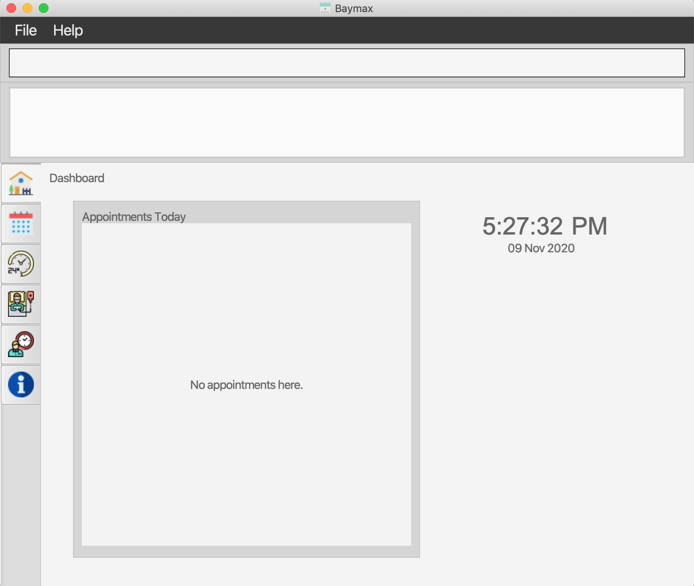 
   *Figure 3a. Baymax Dashboard*

5. When the app is first started, it will contain some sample patients and appointments for you to explore. If you want to take a look at the appointments, for instance, you can type `listappts` into the Command Box and press Enter. You will then be brought to the appointment information tab. 
   
   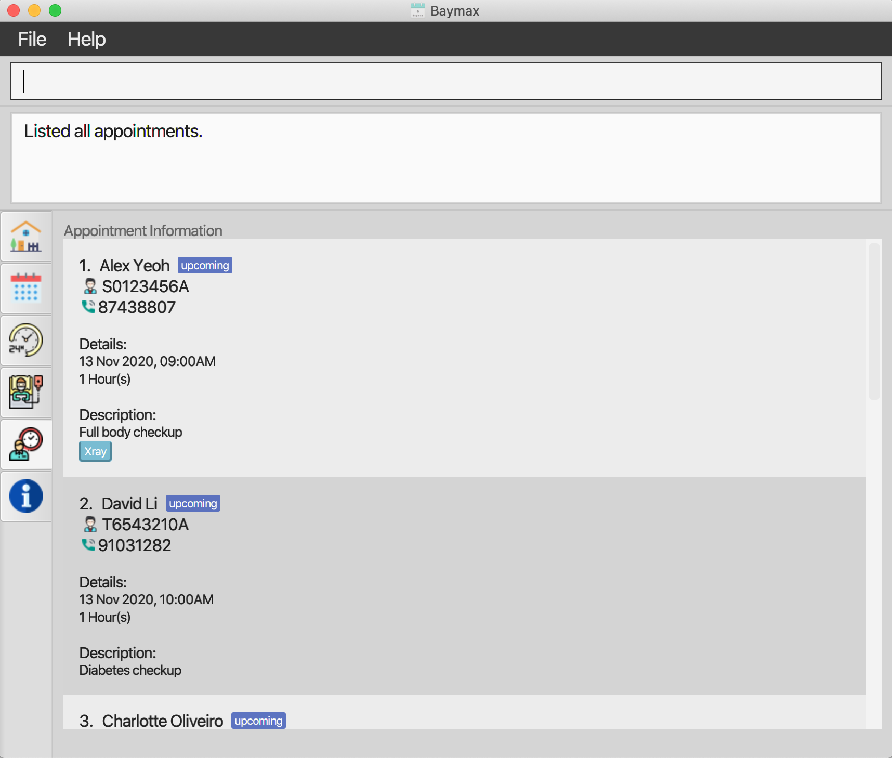 
   *Figure 3b. Baymax Graphical User Interface*
   
   Tip: Typing **`help`** and pressing Enter will open up the help tab, which allows you to learn more commands.

6. Refer to the [Features](#5-features) below for details of each command.

--------------------------------------------------------------------------------------------------------------------

## 4. Navigation Between Tabs

You can use these commands to switch between tabs by specifying the tab name.

**Format:** 
`TAB_NAME`

**Inputs:**

Input      | Description
-----------|------------
TAB_NAME   | The name of the tab you want to switch to. 

TAB_NAME   | Tab that Baymax will switch to
-----------|----------------------------
dashboard  | Dashboard: default view, shows current date and time, and today's appointments
calendar   | Calendar: see [Section 5.3 Calendar](#53-calendar)
schedule   | Schedule: see [Section 5.3.3 Display schedule of a particular day](#533-display-schedule-of-a-particular-day-day)
patient    | Patients: displays current list of patients
appt       | Appointments: displays current list of appointments
help       | Help / Additional Information: displays list of commands

**Example:** 
1. Type `calendar` into the Command Box.
2. Press `Enter` on your keyboard

**Outcome:** 
1. The second tab, featuring the Calendar view, will be displayed as shown in the image below. 

     
    *Figure 4a. Calendar Tab*

-----------------------------------------------------------------------------------

## 5. Features
(Contributed by Thuta and Reuben)

You can find detailed here all of Baymax's main features and how to use their associated commands. Each subsection will guide you with brief notes about the specific feature, as well as the command's format, explanations of its inputs, an example and the expected outcome of running it. 

### 5.1. Patient Information Management

This section contains all the features and commands you can use to manage patient information. These include:

1. Add a new patient
2. List all patients
3. Edit a patient's details
4. Add or change a patient's remark
5. Find patients by name
6. Delete a patient 

#### 5.1.1. Add a new patient: `addpatient`
You can use this command to add a new patient into the Baymax system.

**Format:** 
`addpatient nric/NRIC name/NAME phone/PHONE gender/GENDER [r/REMARK] [tag/TAG]`

**Inputs:** 

Input | Description
---------------|------------
NRIC          | The nric of the patient. It must start with either 'S', 'T', 'F' or 'G' and end with an alphabet <ins>(both case-insensitive)</ins> and contain 7 numbers in between them. E.g. S1234567A, s1234567a
NAME          | The name of the patient. It must only consist of <ins>alphabets and/or numbers (case-insensitive)</ins>. E.g. Alice Tan, Alice1
PHONE         | The hand phone number that the patient wishes to be contacted by. It must be <ins>at least 3 digits</ins> long. It must only consist of numbers. E.g. 91234567
GENDER        | The gender of the patient. Females are indicated by the letter <ins>‘F’</ins> and males are indicated by the letter <ins>‘M’</ins> <ins>(both case-insensitive)</ins>. E.g. M, m, F, f
REMARK        | Any additional information about the patient. Alphabets, numbers, spaces, and special characters (like /*@#) are all allowed. <ins>A blank remark will remove any existing remarks.</ins> E.g. Only available on Mon / Tues
TAG           | One-word tags for categorising and organising patients. A tag must only consist of alphabets and/or numbers and <ins>cannot contain spaces</ins>. A patient can have multiple tags. <ins>A blank tag will remove all existing tags.</ins> E.g. Diabetic, Asthmatic

**Example:** 
1. Type `addpatient nric/S9772234F name/Jason Tan phone/98765432 gender/M tag/Asthmatic` into the Command Box.
2. Press `Enter` on your keyboard.

**Outcome:**

If the command entered is valid:
1. You will see a success message displayed in the Command Result Box as shown below.
2. The patient will be created and added to the system, and you will see the new patient displayed.

    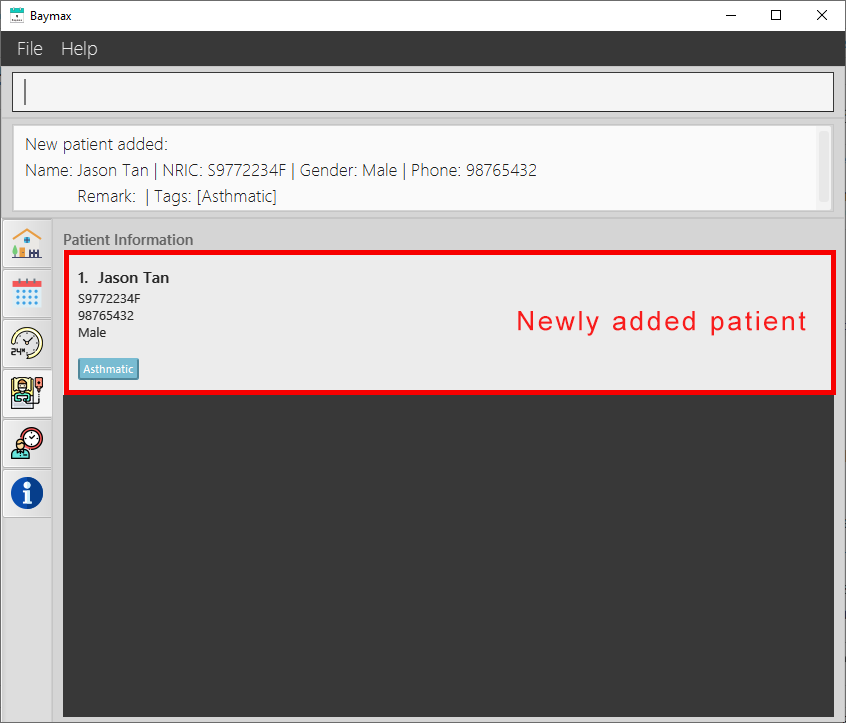 
    *Figure 5.1.1a. Adding a patient - success*

:bulb: **Note:**

When a patient is added successfully, the Main Display only shows the newly added patient. This makes it easier for you to verify that you have added the new patient correctly without having to search through the entire list. 
    
If the command entered is invalid (e.g `NRIC` has 8 numbers in the middle instead of 7):
1. You will see an invalid command message in the Command Result Box, specifying which field was entered incorrectly.  

     
    *Figure 5.1.1b. Adding a patient - failure*

#### 5.1.2. List all patients: `listpatients`
You can use this command to list all the patients in the Baymax system. The Main Display will show a complete list of patients with all their information: name, nric, phone number, gender, remark, and tags.

**Format:** 
`listpatients`

**Example:** 
1. Type `listpatients` into the Command Box.
2. Press `Enter` on your keyboard.

**Outcome:**

1. You will see a success message in the Command Result Box, and a list of all the patients in the system as shown below.

    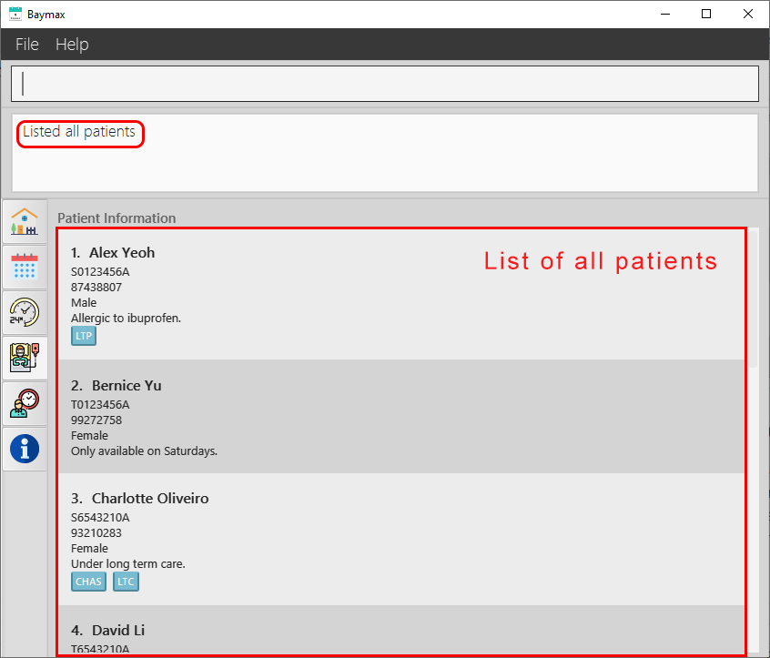 
    *Figure 5.1.2a. Listing all patients*

#### 5.1.3. Edit a patient's information: `editpatient`
You can use this command to edit any information of an existing patient. To specify the patient to edit, use the patient's `INDEX` in the most recently displayed list (learn more about `INDEX` in the 'Inputs' table below).

**Format:** 
`editpatient INDEX <at least 1 patient information field>`

Here are some examples of valid `editpatient` commands:
* `editpatient INDEX name/NAME`
* `editpatient INDEX nric/NRIC`
* `editpatient INDEX phone/PHONE`
* `editpatient INDEX gender/GENDER`
* `editpatient INDEX r/REMARK`
* `editpatient INDEX tag/TAG`
* You can also supply multiple inputs in one command, e.g. `editpatient INDEX gender/GENDER name/NAME phone/PHONE`
* The input(s) supplied will directly replace the original one(s)

**Inputs:**

Input | Description
---------|------------
INDEX     | The number shown beside the patient's name in the <ins>most recently displayed</ins> patient list. This is also the list shown in the Patients Tab and/or the current Main Display. Hence, the index of a patient can change after running certain commands. It must be a positive number.
NRIC          | The nric of the patient. It must start with either 'S', 'T', 'F' or 'G' and end with an alphabet <ins>(both case-insensitive)</ins> and contain 7 numbers in between them. E.g. S1234567A, s1234567a
NAME          | The name of the patient. It must only consist of <ins>alphabets and/or numbers (case-insensitive)</ins>. E.g. Alice Tan, Alice1
PHONE         | The hand phone number that the patient wishes to be contacted by. It must be <ins>at least 3 digits</ins> long. It must only consist of numbers. E.g. 91234567
GENDER        | The gender of the patient. Females are indicated by the letter <ins>‘F’</ins> and males are indicated by the letter <ins>‘M’</ins> <ins>(both case-insensitive)</ins>. E.g. M, m, F, f
REMARK        | Any additional information about the patient. Alphabets, numbers, spaces, and special characters (like /*@#) are all allowed. <ins>A blank remark will remove any existing remarks.</ins> E.g. Only available on Mon / Tues
TAG           | One-word tags for categorising and organising patients. A tag must only consist of alphabets and/or numbers and <ins>cannot contain spaces</ins>. A patient can have multiple tags. <ins>A blank tag will remove all existing tags.</ins> E.g. Diabetic, Asthmatic

**Example:** 
1. Type `editpatient 2 tag/Asthmatic` into the Command Box.
2. Press `Enter` on your keyboard.

**Outcome:**

If the command is valid:
1. You will see a success message in the Command Result Box as shown below.
2. The tags of the patient at index 2 in the recent list will be edited, and you will see the newly edited patient displayed.
    
    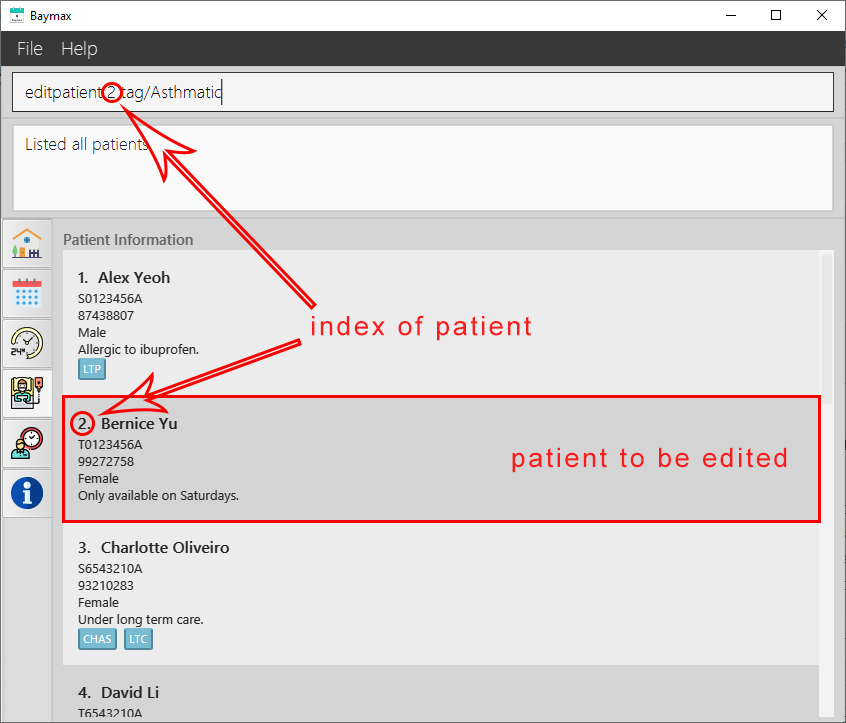 
    *Figure 5.1.3a. Before editing a patient's tag*
    
    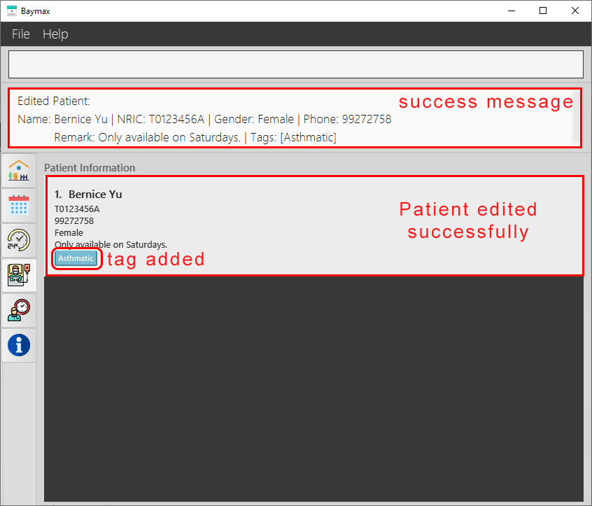 
    *Figure 5.1.3b. Editing a patient's information - success*
    
If the field to be edited is absent (e.g. `editpatient 3` is entered):

1. You will see an invalid command message in the Command Result Box, telling you to provide at least 1 field to edit.

    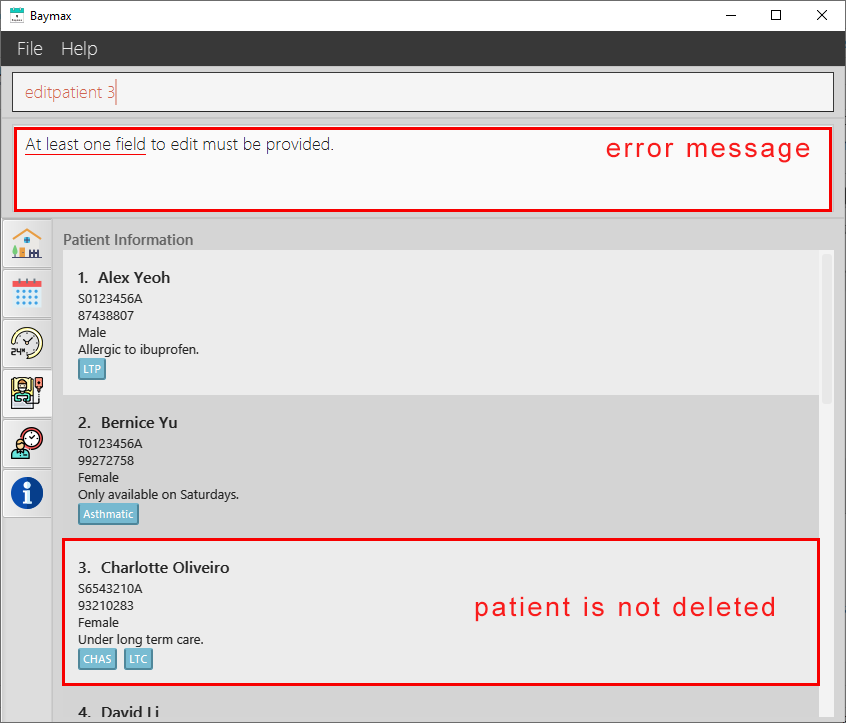 
    *Figure 5.1.3c. Editing a patient's information - failure*

:bulb: **Note:** 

1. When a patient is edited successfully, the Main Display only shows the recently edited patient. This makes it easier for you to verify that you have edited the patient's details correctly without having to search through the entire list. 

2. You can **clear all** existing tags of a patient by entering `editpatient INDEX tag/`

#### 5.1.4. Add a remark to a patient: `remark`
You can use this command to add or replace a patient's remark using their `INDEX` in the most recently displayed list (learn more about `INDEX` in the 'Inputs' table below).

**Format:** 
`remark INDEX r/REMARK`

**Inputs:**

Input | Description
----------|------------
INDEX     | The number shown beside the patient's name in the <ins>most recently displayed</ins> patient list. This is also the list shown in the Patients Tab and/or the current Main Display. Hence, the index of a patient can change after running certain commands. It must be a positive number.
REMARK    | Any additional information about the patient. Alphabets, numbers, spaces, and special characters (like /*@#) are all allowed. <ins>A blank remark will remove any existing remarks.</ins> E.g. Only available on Mon / Tues

**Example:** 
1. Type `remark 6 r/Allergic to penicillin` into the Command Box.
2. Press `Enter` on your keyboard.

**Outcome:**

If the `INDEX` entered is valid:
 
 1. You will see a success message in the Command Result Box as shown below.
    
    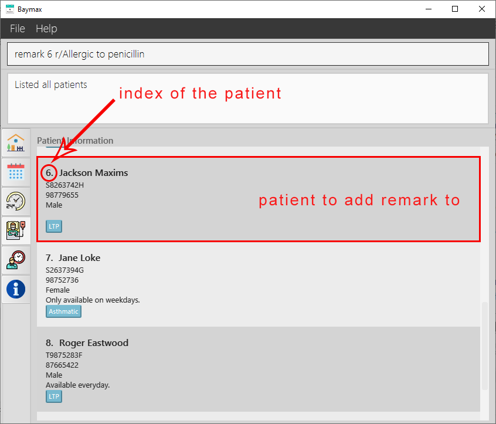 
    *Figure 5.1.4a. Before adding a remark to a patient.*
    
     
    *Figure 5.1.4b. Adding a remark to a patient - success*
    
If the `INDEX` entered is invalid (E.g. `remark 11` is entered, but there are only 9 patients):
 
 1. You will see an invalid index message as shown below.
    
    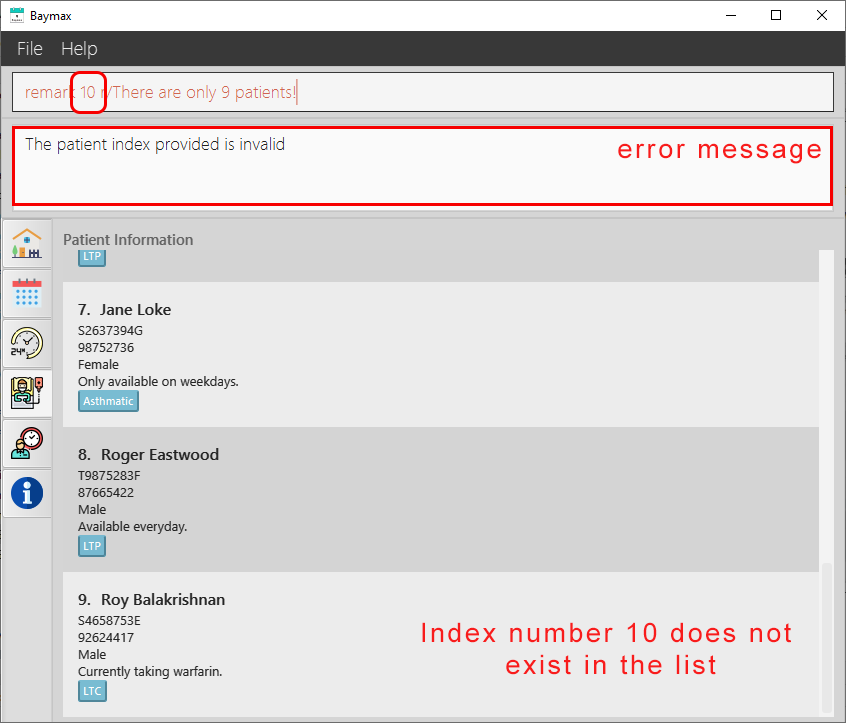 
    *Figure 5.1.4c. Adding a remark to a patient - failure*

:bulb: **Note:**

1. When a patient's remark is added or replaced successfully, the Main Display only shows the patient with the edited remark. This makes it easier for you to verify that you have edited the patient's remark correctly without having to search through the entire list.  

2. Each patient can only have one remark. Using this command when a patient already has a remark will **replace** the existing remark with the new one entered.

3. Entering only `remark INDEX` will **remove** the current remark of the patient at that `INDEX`.

#### 5.1.5. Find patient by name: `findpatient`
You can use this command to find all patients whose name contains the keyword(s) entered. The keyword(s) can be just a part of the name you are searching for, and are case-insensitive.

**Format:** 
`findpatient NAME_KEYWORD`

**Inputs:**

Input | Description
---------------|------------
NAME_KEYWORD   | The name(s) or keyword(s) by which to search for patients. It can be an incomplete part of a patient's name. E.g. `Al Tan` will match with 'Alice Goh', 'Alex Yeoh', and 'Marcus Tan'

**Example:** 
1. Type `findpatient Alex` into the Command Box.
2. Press `Enter` on your keyboard.

**Outcome:**

1. You will see a list of all patients with names that contain the keyword 'Alex'.

    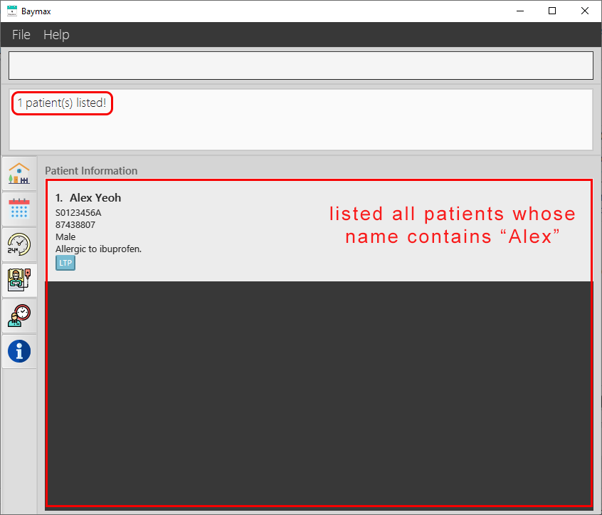 
    *Figure 5.1.5a. Finding a patient by name - success*
    
2. If there are no patients with a matching name, then none will be displayed as shown below.
    
    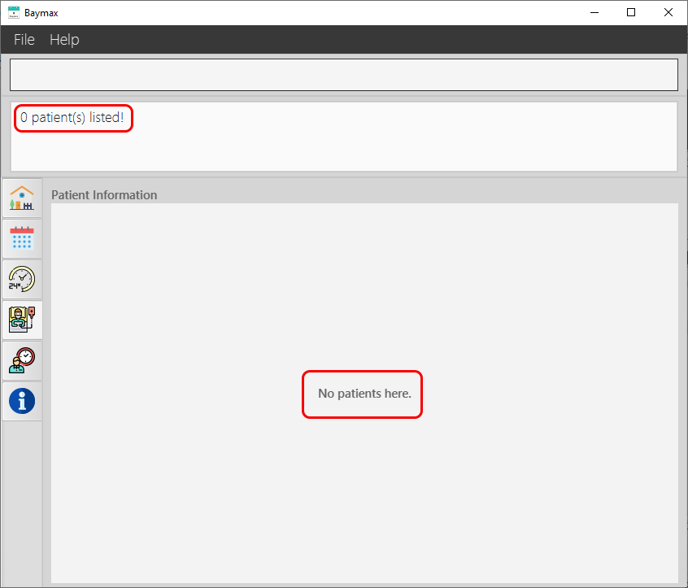 
    *Figure 5.1.5b. Finding a patient by name - failure*

#### 5.1.6. Delete a patient: `deletepatient`
You can use this command to delete a patient using their `INDEX` in the most recently displayed list (learn more about `INDEX` in the 'Inputs' table below). 

**Warnings:** 

1. The current version of Baymax **does not support undoing/redoing**. Be careful when using the `deletepatient` command as this action is irreversible. 

2. When you delete a patient, **all the appointments** associated with that patient will also be deleted.

**Format:** 
`deletepatient INDEX`

**Inputs:**

Input | Description
---------------|------------
INDEX     | The number shown beside the patient's name in the <ins>most recently displayed</ins> patient list. This is also the list shown in the Patients Tab and/or the current Main Display. Hence, the index of a patient can change after running certain commands. It must be a positive number.

**Example:** 
1. Type `deletepatient 8` into the Command Box.
2. Press `Enter` on your keyboard.

**Outcome:**

If the `INDEX` entered is valid:
1. You will see a success message in the Command Result Box as shown below.
2. The patient at index 8 in the recent list will be deleted.

     
    *Figure 5.1.6a. Deleting a patient - success*

If the `INDEX` entered is invalid (E.g `deletepatient 11` is entered, but there are only 9 patients):
1. You will see an invalid index message as shown below.

    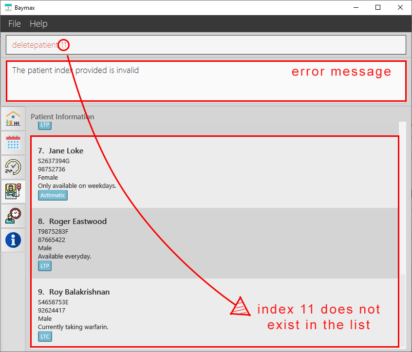 
    *Figure 5.1.6b. Deleting a patient - failure*
    
----------------------------------------------------------------------------------

### 5.2. Appointment Information Management

This section contains all the features and commands you can use to manage appointment information. These include:

1. Add a new appointment
2. List all appointments
3. List all appointments of a patient
4. Edit an appointment's details
5. Mark an appointment as done
6. Mark an appointment as missed
7. Find an appointment by keyword
8. Cancel an appointment

#### 5.2.1. Add a new appointment: `addappt`
You can use this command to add a new appointment for an existing patient. To specify the patient, use either their `INDEX` in the most recently displayed patient list, or their `NRIC`. To specify the date-time of the appointment, you can supply either the full `DATETIME` using `on/`, or only the `TIME` using `at/` (learn more about this in the 'Inputs' table below).

**Format:** 
`addappt INDEX on/DATETIME dur/DURATION desc/DESCRIPTION [tag/TAG]` 
`addappt INDEX at/TIME dur/DURATION desc/DESCRIPTION [tag/TAG]` 
`addappt nric/NRIC on/DATETIME dur/DURATION desc/DESCRIPTION [tag/TAG]` 
`addappt nric/NRIC at/TIME dur/DURATION desc/DESCRIPTION [tag/TAG]` 

**Inputs:**

Input | Description
---------------|------------
INDEX     | The number shown beside the patient's name in the <ins>most recently displayed</ins> patient list. This is also the list shown in the Patients Tab and/or the current Main Display. Hence, the index of a patient can change after running certain commands. It must be a positive number.
NRIC          | The nric of the patient. It must start with either 'S', 'T', 'F' or 'G' and end with an alphabet <ins>(both case-insensitive)</ins> and contain 7 numbers in between them. E.g. S1234567A, s1234567a
DATETIME       | The date followed by the time of the appointment. It must be in <ins>DD-MM-YYYY HH:MM</ins> format. E.g. 20-01-2020 15:00
TIME           | The time of the appointment. It must be in <ins>HH:MM</ins> format following the 24-hour system. E.g. 15:00. The date will be inferred from the date set in the calendar (see [Section 5.3 Calendar](#53-calendar).
DURATION       | The duration of the appointment in <ins>minutes</ins>. It must be a positive whole number, and the appointment must not extend to the next day. E.g. 60
DESCRIPTION    | The description of the appointment. Alphabets, numbers, spaces, and special characters (like /*@#) are all allowed. E.g. Wrist fracture check-up #3
TAG            | One-word tags for categorising and organising appointments. A tag must only consist of alphabets and/or numbers and <ins>cannot contain spaces</ins>. An appointment can have multiple tags. <ins>A blank tag will remove all existing tags.</ins> E.g. Xray, MRI

**Example:** 
1. Type `addappt 1 on/11-11-2020 12:30 dur/60 desc/Removal of braces. tag/Dental` into the Command Box.
2. Press `Enter` on your keyboard.

**Outcome:**

If the command entered is valid:
1. You will see a success message in the Command Result Box as shown below.  

     
    *Figure 5.2.1a. Scheduling a new appointment for a patient*

If the command entered is invalid (e.g. `DATETIME` supplied is of the wrong format):
1. You will see an invalid command message in the Command Result Box, specifying which field was entered incorrectly.  

:bulb: **Note:** 

1. Either `INDEX` or `NRIC` should be provided. If both are provided, the `INDEX` will be taken.
2. Either `DATETIME` or `TIME` should be provided. If both are provided, the `DATETIME` will be taken.
3. For your convenience, newly added appointments with `DATETIME` before the current date and time will be automatically marked as `done`, i.e. these are taken as backdated appointments that have already occurred. 

#### 5.2.2. List all appointments: `listappts`

You can use this command to list all the appointments in the Baymax system, which belong to any patient. The Main Display will show a complete list of appointments with all their information: patient it belongs to, date and time, duration, description and tags.

**Format:** 
`listappts`

**Example:** 
1. Type `listappts` into the Command Box.
2. Press `Enter` on your keyboard.

**Outcome:**

1. You will see a success message in the Command Result Box, and a list of all the appointments in the system as shown below.

     
    *Figure 5.2.2a. Listing all appointments*

#### 5.2.3. List all appointments of a patient: `listapptsof`
You can use this command to list all the appointments belonging to a certain patient. To specify the patient, use either their `INDEX` in the most recently displayed patient list, their `NRIC`, or their full `NAME` (learn more about this in the 'Inputs' table below).

:bulb: **Note:** 
One tip for this command is to first find patients by name using the `findpatient` command. Then, execute `listapptsof` with the patient’s `INDEX` in the newly obtained list to get all appointments of that patient.

**Format:** 
`listapptsof INDEX` 
`listapptsof nric/NRIC` 
`listapptsof name/NAME` 

**Inputs:**

Input | Description
----------|------------
INDEX     | The number shown beside the patient's name in the <ins>most recently displayed</ins> patient list. This is also the list shown in the Patients Tab and/or the current Main Display. Hence, the index of a patient can change after running certain commands. It must be a positive number.
NRIC      | The nric of the patient. It must start with either 'S', 'T', 'F' or 'G' and end with an alphabet <ins>(both case-insensitive)</ins> and contain 7 numbers in between them. E.g. S1234567A, s1234567a
NAME      | The name by which to search for the patient. It must be the <ins>exact full name</ins> of the patient.

**Example:** 
1. Type `listapptsof 1` into the Command Box.
2. Press `Enter` on your keyboard.

**Outcome:**

If the command entered is valid:
1. You will see a list of all appointments associated with the patient as shown below.

    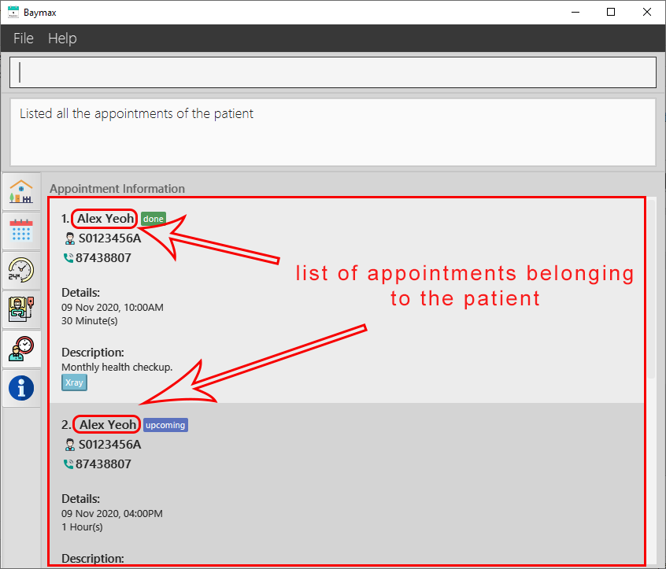 
    *Figure 5.2.3a. Listing the appointments of a patient*

#### 5.2.4. Edit an appointment: `editappt`
You can use this command to edit any information of an existing appointment. To specify the appointment to edit, use the appointment's `INDEX` in the most recently displayed appointment list (learn more about `INDEX` in the 'Inputs' table below).

**Format:** 
`editappt INDEX <at least 1 appointment information field>`

Here are some examples of valid `editappt` commands:
* `editappt INDEX on/DATETIME`
* `editappt INDEX dur/DURATION`
* `editappt INDEX desc/DESC`
* `editappt INDEX tag/TAG`
* You can also supply multiple inputs in one command, e.g. `editappt INDEX on/DATETIME tag/TAG desc/DESC`
* The input(s) supplied will directly replace the original one(s)

**Inputs:**

Input | Description
---------------|------------
INDEX     | The number shown beside the appointment in the <ins>most recently displayed</ins> appointment list. This is also the list shown in the Appointments Tab and/or the current Main Display. Hence, the index of an appointment can change after running certain commands. It must be a positive number.
DATETIME       | The date followed by the time of the appointment. It must be in <ins>DD-MM-YYYY HH:MM</ins> format. E.g. 20-01-2020 15:00
DURATION       | The duration of the appointment in <ins>minutes</ins>. It must be a positive whole number, and the appointment must not extend to the next day. E.g. 60
DESCRIPTION    | The description of the appointment. Alphabets, numbers, spaces, and special characters (like /*@#) are all allowed. E.g. Wrist fracture check-up #3
TAG            | One-word tags for categorising and organising appointments. A tag must only consist of alphabets and/or numbers and <ins>cannot contain spaces</ins>. An appointment can have multiple tags. <ins>A blank tag will remove all existing tags.</ins> E.g. Xray, MRI

**Example:** 
1. Type `editappt 10 on/12-11-2020 12:00` into the Command Box.
2. Press `Enter` on your keyboard.

**Outcome:**

If the command is valid:
1. You will see a success message in the Command Result Box as shown below.
2. The `DATETIME` of the appointment at index 10 in the recent list will be edited.
    
     
    *Figure 5.2.4a. Before editing an appointment*
    
     
    *Figure 5.2.4b. After editing an appointment*

:bulb: **Note:**

When an appointment is edited successfully, the Main Display only shows the recently edited appointment. This makes it easier for you to verify that you have edited the appointment's details correctly without having to search through the entire list.   

#### 5.2.5. Mark an appointment as done: `done`
You can use this command to mark an existing appointment as done. To specify the appointment, use either its `INDEX` in the most recently displayed appointment list, or its `DATETIME` with the full `NAME` of the patient it belongs to. 

**Notes:**  
1. Baymax automatically marks appointments as done once they are past the current date and time.
2. You cannot mark any upcoming appointments as done.

**Format:** 
`done INDEX` 
`done on/DATETIME name/NAME`

**Inputs:**

Input | Description
---------------|------------
INDEX     | The number shown beside the appointment in the <ins>most recently displayed</ins> appointment list. This is also the list shown in the Appointments Tab and/or the current Main Display. Hence, the index of an appointment can change after running certain commands. It must be a positive number.
DATETIME       | The date followed by the time of the appointment. It must be in <ins>DD-MM-YYYY HH:MM</ins> format. E.g. 20-01-2020 15:00
NAME           | The name by which to search for the patient. It must be the <ins>exact full name</ins> of the patient.

**Example:** 
1. Type `done 7` into the Command Box.
2. Press `Enter` on your keyboard.

**Outcome:**

If the command entered is valid:
1. You will see a success message in the Command Result Box as shown below.
2. The appointment at index 7 in the recent list will be marked as done.
    
     
    *Figure 5.2.5a. Before marking an appointment as done*
    
    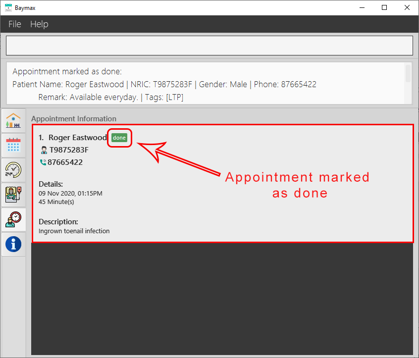 
    *Figure 5.2.5b. Marking an appointment as done*
   
:bulb: **Note:**

When an appointment is marked as done successfully, the Main Display only shows that appointment. This makes it easier for you to verify that the appointment is marked as `done` without having to search through the entire list. 
    
#### 5.2.6. Mark an appointment as missed: `missed`
You can use this command to mark an existing appointment as missed. To specify the appointment, use either its `INDEX` in the most recently displayed appointment list, or its `DATETIME` with the full `NAME` of the patient it belongs to. 

**Format:** 
`missed INDEX`  
`missed on/DATETIME name/NAME`

**Inputs:**

Input | Description
---------------|------------
INDEX     | The number shown beside the appointment in the <ins>most recently displayed</ins> appointment list. This is also the list shown in the Appointments Tab and/or the current Main Display. Hence, the index of an appointment can change after running certain commands. It must be a positive number.
DATETIME       | The date followed by the time of the appointment. It must be in <ins>DD-MM-YYYY HH:MM</ins> format. E.g. 20-01-2020 15:00
NAME           | The name by which to search for the patient. It must be the <ins>exact full name</ins> of the patient.

**Example:** 
1. Type `missed 7` into the Command Box.
2. Press `Enter` on your keyboard.

**Outcome:**

If the command entered is valid:
1. You will see a success message in the Command Result Box as shown below.
2. The appointment at index 7 in the recent list will be marked as missed.
    
     
    *Figure 5.2.6a. Before marking an appointment as missed*
    
    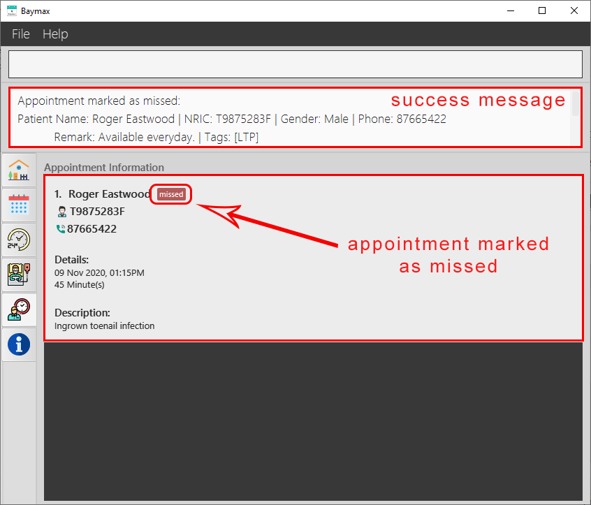 
    *Figure 5.2.6b. Marking an appointment as missed*

:bulb: **Note:**

When an appointment is marked as `missed` successfully, the Main Display only shows that appointment so that you do not need to scroll through the appointment list to ensure that the appointment is marked as `missed`.    

#### 5.2.7. Find appointment by keyword: `findappt`
You can use this command to find all appointments whose description or tags contain the keyword(s) entered. The keyword(s) can be just a part of the description or tag you are searching for, and are case-insensitive.

**Format:** 
`findappt KEYWORD`

**Inputs:**

Input | Description
---------------|------------
KEYWORD  | The keyword(s) by which to search for appointments. It can be an incomplete part of an appointment's <ins>description or tag</ins>. E.g. `Remov` will match with the description 'Remove braces' and the tag 'Removal'

**Example:** 
1. Type `findappt check` into the Command Box.
2. Press `Enter` on your keyboard.

**Outcome:**

You will see a list of all appointments with description or tags that contain the keyword 'check'. 
    
   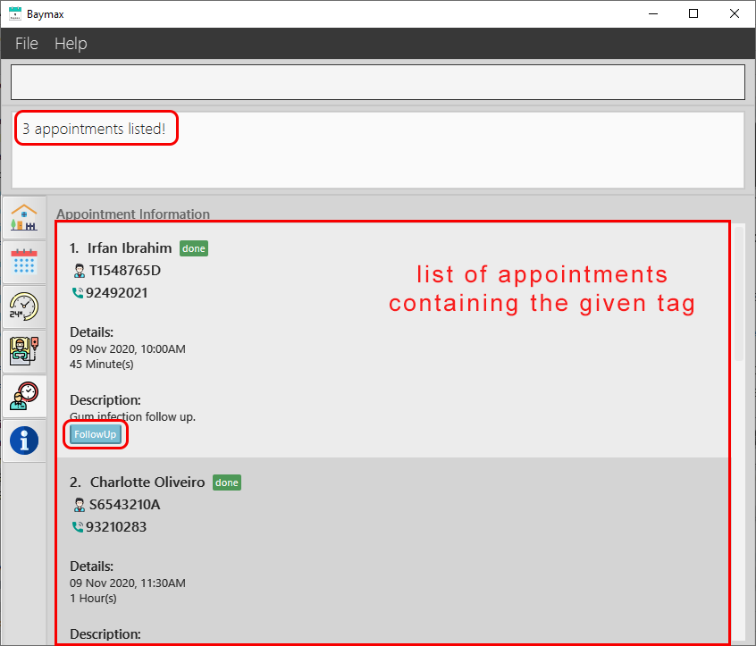 
   *Figure 5.2.7a. Finding an appointment by tag*

#### 5.2.8. Cancel an appointment: `cancel`
You can use this command to cancel an existing appointment. To specify the appointment, use either its `INDEX` in the most recently displayed appointment list, or its `DATETIME` with the full `NAME` of the patient it belongs to. 

**Format:** 
`cancel INDEX`  
`cancel on/DATETIME name/NAME`

**Inputs:**

Input | Description
---------------|------------
INDEX     | The number shown beside the appointment in the <ins>most recently displayed</ins> appointment list. This is also the list shown in the Appointments Tab and/or the current Main Display. Hence, the index of an appointment can change after running certain commands. It must be a positive number.
DATETIME       | The date followed by the time of the appointment. It must be in <ins>DD-MM-YYYY HH:MM</ins> format. E.g. 20-01-2020 15:00
NAME           | The name by which to search for the patient. It must be the <ins>exact full name</ins> of the patient.

**Example:** 
1. Type `cancel 1` into the Command Box.
2. Press `Enter` on your keyboard.

**Outcome:**

If the command entered is valid:
1. You will see a success message in the Command Result Box as shown below.
2. The appointment at index 1 in the recent list will be removed.
    
     
    *Figure 5.2.8a. Before cancelling an appointment*
    
    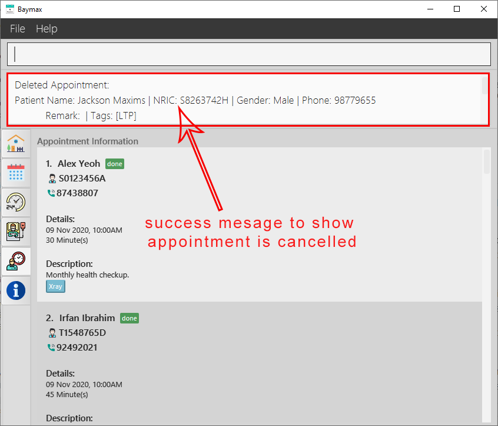 
    *Figure 5.2.8b. After cancelling an appointment*
    
:warning: **Warning:** 

The current version of Baymax **does not support undoing/redoing**. Be careful when using the `cancel` command as this action removes the appointment from the system permanently and is irreversible. 
    
-------------------------------------------------------------------------------

### 5.3. Calendar 
Baymax Calendar allows you to easily visualise the availability of all the days within a month, and to see the schedule of a particular day. When switching to the Calendar Tab, Baymax will display the current month and year by default, until you specify something else.

The following subsections will guide you through how to use the Calendar.

:bulb: **Note:**

The dates in the calendar view are **not** clickable.

#### 5.3.1. Switch to a particular year: `year`
You can use this command to switch to a particular year and view the appointments in a calendar format.

**Format:** 
`year YEAR`

**Inputs:**

Input | Description
---------------|------------
YEAR          | The year you want to switch Calendar to. It must be a <ins>4-digit positive</ins> number from 1900 to 2100 (inclusive). E.g. 2020

**Example:** 
1. Type `year 2019` into the Command Box.
2. Press enter on your keyboard.

**Outcome:** 

1. You will see the Calendar Tab displayed, with a view of the currently selected month in the year 2019.

    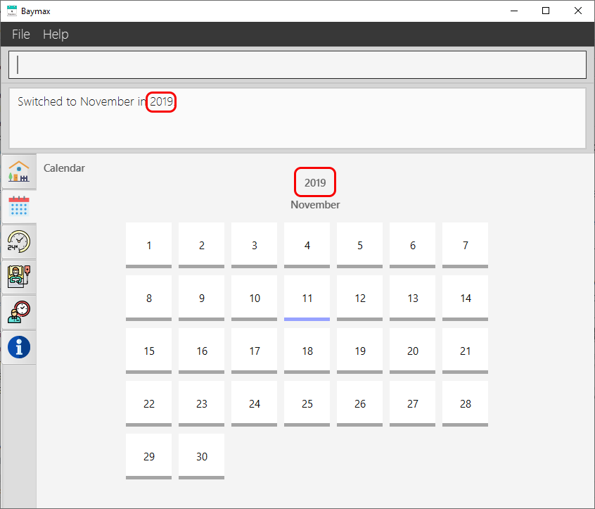 
    *Figure 5.3.1a. Switching the year to 2019*

#### 5.3.2. Switch to a particular month: `month`
You can use this command to switch to a particular month and view the appointments in a calendar format.

**Format:** 
`month MONTH`

**Inputs:**

Input | Description
---------------|------------
MONTH          | The month you want to switch Calendar to. It must be a positive number from <ins>1 to 12</ins>, or the <ins>name of the month</ins>, either in full or as its <ins>first 3 letters</ins> (case-insensitive). E.g. 1, January, Jan

**Example:** 

1. Type `year 2019` into the Command Box and press Enter to switch to the year 2019.
2. Type `month 9` or `month september` or `month sep` into the Command Box.
3. Press Enter on your keyboard.

**Outcome:** 

1. You will see the Calendar Tab displayed, with a view of the month September in the currently selected year.

    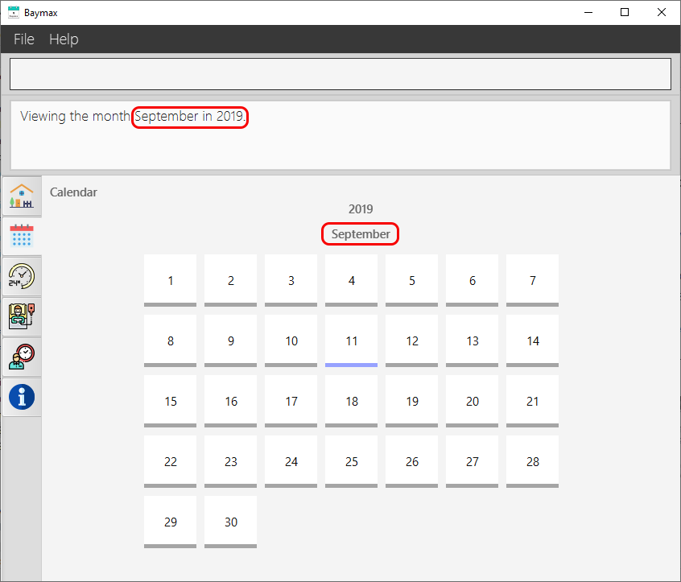 
    *Figure 5.3.2a. Switching the month to September*

#### 5.3.3. Display schedule of a particular day: `day`
You can use this command to display the schedule of a particular day. This switches from the Calendar to the Schedule view of the day, displaying a timetable of appointments.

Input | Description
---------------|------------
DAY            | The day of the month you want to switch to. It must be a <ins>positive</ins> number from 1 to the last day of the month (inclusive). E.g. if the month is January (which has 31 days), the range of numbers you can enter is 1 to 31.

**Format:** 
`day DAY`

**Example:** 
1. Type `year 2020` into the Command Box and press Enter to switch to the year 2020.
2. Type `month 11` into the Command Box and press Enter to switch to the month November.
3. Type `day 9` into the Command Box.
4. Press Enter on your keyboard.

**Outcome:** 
1. You will see the Schedule for the day 09-11-2020.

     
    *Figure 5.3.3a. Viewing the schedule for 9th November 2020*
    
:bulb: **Note:**

For the `addappt` command, where the `at/TIME` field can be specified in place of the `on/DATETIME` field, the appointment will be set on the current selected date of the Calendar. E.g. if the schedule for 09-11-2020 was last displayed in Calendar, the command `addappt 1 at/13:00 ...` will set the date and time of the appointment as 9 November 2020, 1.00PM (even if you had run other Patient and Appointment commands after).
    
----------------------------------------------------------------------------------

### 5.4. Utilities

These are some generic commands which will be useful to you along the way.

#### 5.4.1. View help: `help`

You can use this command to see a quick summary of commands available in Baymax, or to get the URL link to the full User Guide (this document) for more details about the commands.

**Format:** 
`help`

**Example:** 
1. Type `help` into the Command Box.
2. Press `Enter` on your keyboard.

**Outcome:** 
1. You will see a link directing you to this User Guide, together with a summarised list of commands.

     
    *Figure 5.4.1a. Executing `help` command*

#### 5.4.2. Exit the program : `exit`

You can use this command to exit the program.

**Format:** `exit`

**Example:** 
1. Type `exit` into the Command Box.
2. Press `Enter` on your keyboard.

**Outcome:** 
1. The application window will close, and Baymax will stop running. 

#### 5.4.3. Clear all data in Baymax: `clear`

You can use this command to remove all the patient and appointment information in Baymax.

:warning: **Warning:**  
This is a command to be used with **caution** as it permanently removes all data in Baymax, and is irreversible. 

**Format:** `clear`

**Example:** 
1. Type `clear` into the Command Box.
2. Press `Enter` on your keyboard.

**Outcome:** 
1. You will see that all patients and appointments in Baymax have been cleared, as shown below.
    
    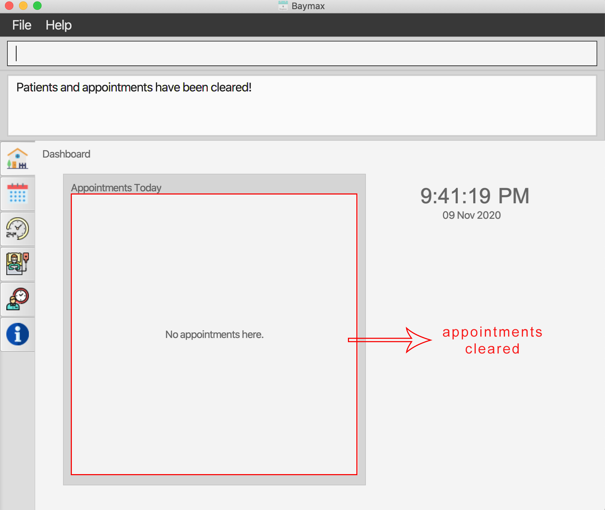 
    *Figure 5.4.3a. Executing `clear` command*
    
     
    *Figure 5.4.3b. Patient List when `listpatients` is entered*
    
    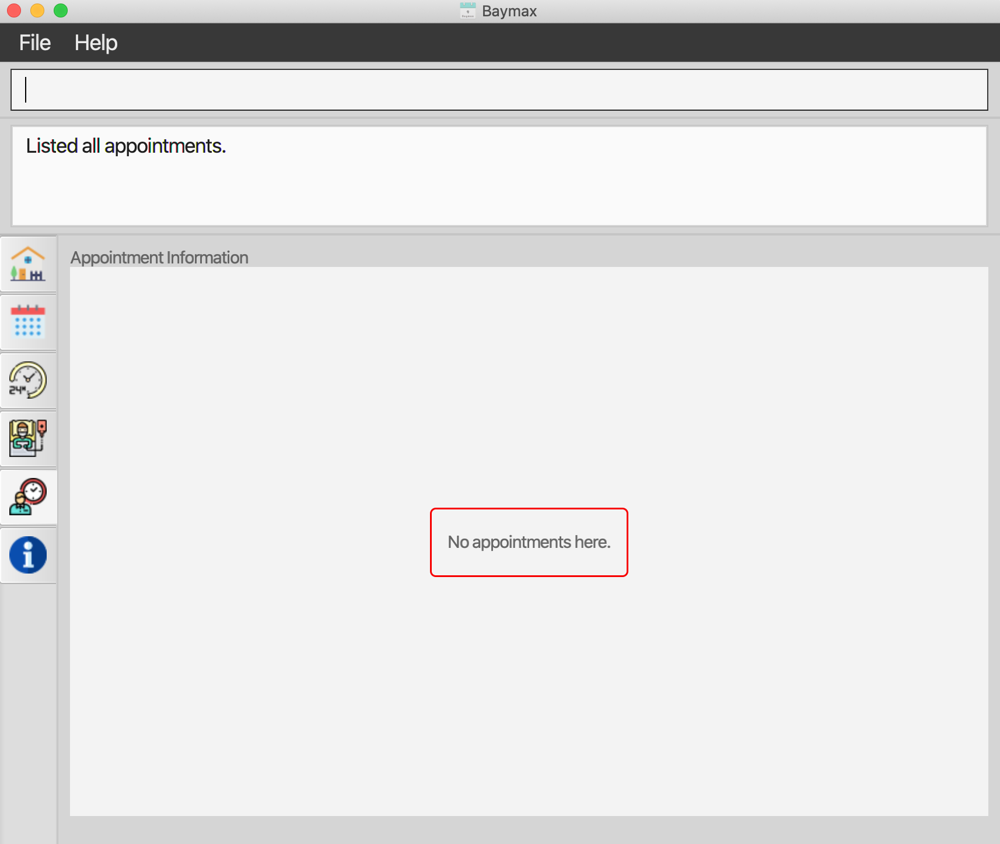 
    *Figure 5.4.3c. Appointment List when `listappts` is entered*
    
---------------------------------------------------------------------------------

### 5.5. Features coming in Version 2.0

We are looking forward to bringing you these new features in the next version of Baymax.

#### 5.5.1. Undo/Redo `v2.0`

This feature will allow you to undo/redo the previous few commands.

#### 5.5.2. Display appointments within a period `v2.0`

This feature will allow you to view all the appointments within a specified period, defined by a start `day` and an end
`day`. 

---------------------------------------------------------------------------------

## 6. FAQ
(Contributed by Hui Ling)

**Q:** Do I have to manually save any data? 

**A:** No. Baymax saves your data to the hard disk automatically after any command that changes data. 

**Q:** How do I transfer my data to another computer?

**A:** Baymax automatically saves all your data in a folder named `data` in the same folder as the application.
 You can copy and transfer the `data` folder into the same folder as Baymax on your other computer and Baymax 
 will automatically load your data upon launching.

---------------------------------------------------------------------------------

## 7. Command Summary
(Contributed by Hui Ling and Reuben)

This section summarises all the commands that are currently available in Baymax.

### 7.1. Patient Information Management Commands

**Purpose** | **Command**             | **Example**
------------|------------|--------------------
Add a Patient| `addpatient nric/NRIC name/NAME phone/PHONE gender/GENDER [r/REMARK] [tag/TAG]` | `addpatient nric/S9772234F name/Jason Tan phone/98765432 gender/M` 
List All Patients| `listpatients` | `listpatients`
Delete a Patient| `deletepatient INDEX` | `deletepatient 4`
Edit a Patient's Information| `editpatient INDEX <at least 1 patient information field>` | `editpatient INDEX phone/82345678`
Find a Patient| `findpatient NAME_KEYWORD` | `findpatient Alex`
Add a Remark| `remark INDEX r/REMARK` | `remark 2 r/Not free on Fridays`

### 7.2. Appointment Information Management Commands

**Purpose** |**Command**             | **Example**
-------------|-----------|--------------------
Add an Appointment| `addappt (INDEX` OR `nric/NRIC) (on/DATETIME` OR `at/TIME) dur/DURATION desc/DESCRIPTION [tag/TAG]` | `addappt nric/S1234567C on/11-10-2020 12:30 dur/60 desc/Removal of braces. tag/DrGoh tag/1HR`
List Appointments of a Patient|`listapptsof INDEX` | `listapptsof 1`
List all Appointments| `listappts` | `listappts`
Edit an Appointment| `editappt INDEX <at least 1 appointment information field>` | `editappt 1 on/12-10-2020 12:00`
Cancel an Appointment| `cancel INDEX` OR `cancel on/DATETIME name/NAME` | `cancel on/20-01-2020 15:00 name/Alex `
Mark an Appointment as done|`done INDEX` OR `done on/DATETIME name/NAME` | `done on/20-01-2020 15:00 name/Charlotte`
Mark an Appointment as missed| `missed INDEX` OR `missed on/DATETIME name/NAME` | `missed 1`
Find an Appointment| `findappt DESCRIPTION_KEYWORD` OR `findappt TAG_KEYWORD` | `findappt eye`

### 7.3. Calendar Commands

**Purpose** |**Command**             | **Example**
-------------|-----------|--------------------
Switch to a particular year| `year YEAR` | `year 2021`
Switch to a particular month| `month MONTH` | `month 11`
Display schedule of a particular day| `day DAY` | `day 15`

### 7.4. Utility Commands

**Purpose** |**Command**             | **Example**
-------------|-----------|--------------------
View help| `help` | `help`
Switch between tabs| `TAB_NAME` | `calendar`
Exit the program | `exit` | `exit`
Clear all data| `clear`   | `clear`

